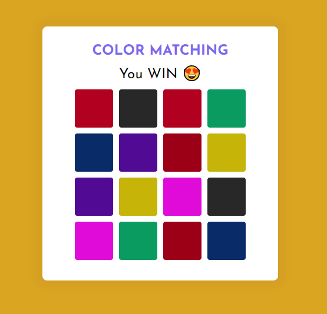

# Color Matching Game | Written in pure javascript

A good way to practice javascript by building this simple game.

DEMO: [https://color-matching-game.vercel.app/](https://color-matching-game.vercel.app/)

## Game rule 

- Has only one mode, one level. You need to find all matched colors in 30s.
- When a color pair is matched, the background will be updated to the matched color.
- When game is timeout, `Game Over` message will be displayed.
- If you can find all colors in less than 30s, `You win 😍` message will be displayed.
- When game is finished, a `Play Again` button is displayed.
- Color list will be randomized every time you start a new game.

## Techstacks

- HTML/CSS
- Pure Javascript
- Lib: [randomColor.js](https://randomcolor.lllllllllllllllll.com/) to random attractive colors

Hope you enjoy playing this game 🤩